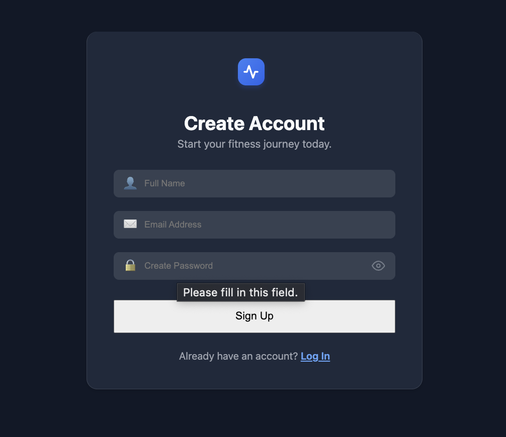
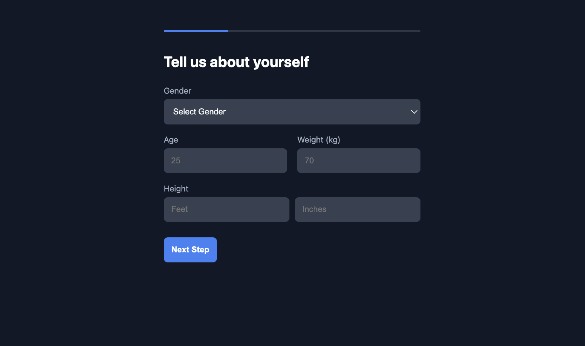
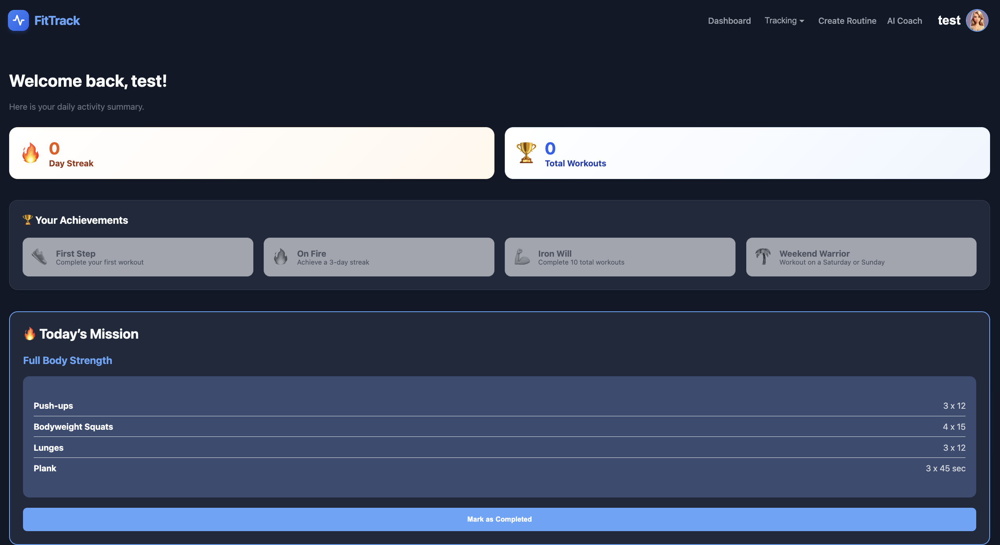
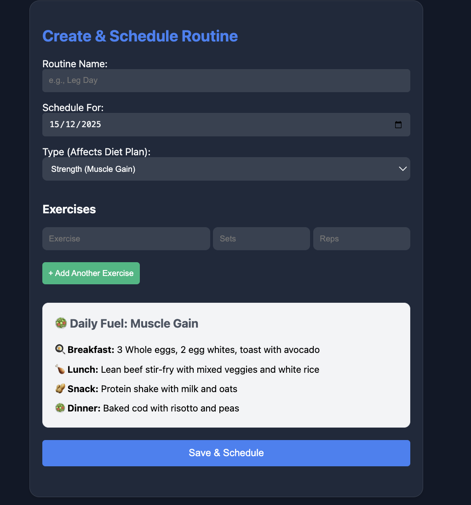

# 🏋️ Workout Planner — Full-Stack Web Application

## 📌 Problem Statement

Maintaining a consistent workout routine is challenging due to poor planning, lack of reminders, and no structured way to track progress. Many users struggle to organize workouts, remember schedules, and stay motivated over time.

The **Workout Planner** application solves this problem by providing a **calendar-based workout planning and tracking system** that helps users plan, schedule, and monitor workouts efficiently.

---

## 🎯 Objectives

- Enable users to plan workouts in advance
- Provide a structured calendar-based scheduling system
- Allow users to track workout completion and history
- Improve fitness consistency through reminders and progress tracking
- Deliver a clean, responsive, and user-friendly experience

---

## 👥 Target Users

- Fitness beginners and intermediate users
- Students and working professionals
- Users looking for a simple workout planning and tracking solution

---

## 🧾 Project Overview

**Workout Planner** is a **full-stack, responsive fitness web application** that allows users to securely register, create workout routines, schedule them on a calendar, track progress, and receive notifications.

The application works seamlessly across **desktop and mobile devices**, ensuring an optimal user experience on all screen sizes.

---

## ✨ Features

### 🔐 Authentication & Security
- Secure user registration and login
- JWT-based authentication
- Role-based access control (User / Admin)
- Protected routes for authenticated users

### 🏋️ Workout Management
- Create workout plans with:
  - Exercise name
  - Workout type (Cardio, Strength, Yoga)
  - Sets, reps, or duration
  - Target muscle groups
- Edit or delete workouts
- Predefined workout templates (optional)

### 📅 Workout Scheduling
- Calendar-based workout scheduling
- Supports daily, weekly, and monthly plans
- View upcoming and past workouts

### 📊 Progress Tracking & Dashboard
- Mark workouts as completed
- View completed workout history
- Dashboard overview of upcoming workouts and past activity
- Streaks and achievement tracking

### 🔔 Notifications
- Email reminders for scheduled workouts (optional advanced feature)

### 🎮 Gamification
- Badges for workout consistency
- Streak-based achievements (e.g., 7-day streak)

### 📱 Responsive UI
- Fully responsive design
- Optimized for laptop, tablet, and mobile screens

---

## 🛠 Tech Stack

### Frontend
- React.js (Functional Components & Hooks)
- React Router
- Context API
- CSS / Tailwind / Styled Components

### Backend
- Node.js
- Express.js
- RESTful API architecture

### Database
- MongoDB
- Mongoose ODM

### Authentication
- JWT (JSON Web Tokens)
- Google OAuth (optional)

### Notifications
- Email notifications (NodeMailer or similar)

### Version Control
- Git & GitHub

### Deployment (Optional)
- Frontend: Vercel / Netlify
- Backend: Render / Railway
- Database: MongoDB Atlas

---

## 🏗 Project Architecture

### Frontend Structure
src/
├── components/
├── pages/
├── routes/
├── context/
├── services/
└── utils/

### Backend Structure
server/
├── controllers/
├── routes/
├── models/
├── middleware/
├── config/
└── server.js

### Application Flow
- Frontend communicates with backend using REST APIs
- Backend handles business logic and database operations
- JWT middleware secures protected routes
- Email service sends workout reminders

---

## ⚙️ Setup Instructions

### 🔧 Prerequisites
Ensure the following are installed:
- Node.js (v18 or above)
- npm or yarn
- MongoDB (local or MongoDB Atlas)
- Git

---

### 📥 Clone the Repository
```bash
git clone https://github.com/your-username/workout-planner.git
cd workout-planner

### backend setup 
cd backend
npm install
npm run dev

#server runs at 
http://localhost:5001

### frontend setup
cd frontend
npm install
npm start

#frontend runs at 
http://localhost:5173

🔐 Environment Variables (.env Setup)

Why .env?

The .env file stores sensitive credentials securely and prevents them from being exposed in the codebase.

Backend .env
PORT=5001
MONGO_URI=your_mongodb_connection_string
JWT_SECRET=your_jwt_secret
EMAIL_USER=your_email_address
EMAIL_PASS=your_email_password
GOOGLE_CLIENT_ID=your_google_client_id
GOOGLE_CLIENT_SECRET=your_google_client_secret

⚠️ Do not commit .env files to GitHub

🔑 Google Authentication
	•	Google OAuth enables secure sign-in
	•	OAuth credentials are configured in Google Cloud Console
	•	Tokens are handled securely using JWT
	•	New users are redirected to onboarding after first login

    --🗄 Database Design

Users Collection
	•	Name
	•	Email
	•	Password (hashed)
	•	Role
	•	OAuth provider details

Workouts Collection
	•	Exercise name
	•	Workout type
	•	Sets / reps / duration
	•	Target muscle groups
	•	Scheduled date
	•	Completion status

Progress Tracking
	•	Completed workouts
	•	Streaks
	•	Achievements


    📸 Screenshots






Future Improvements :-
🤖 AI Chatbot: Integration with OpenAI API to answer fitness queries.

📱 Mobile App: Converting the React frontend to React Native for iOS/Android.

🔗 Social Sharing: Ability to share workout streaks on social media.


 Author

Kshitija Renuke
Full-Stack Developer